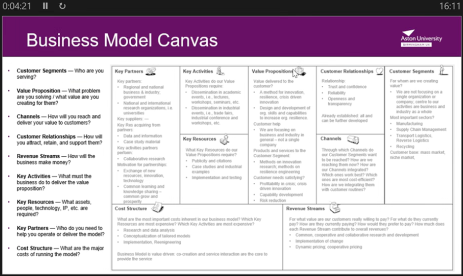

# Evaluating Temporal Knowledge-Graph Retrieval for Evidence-Grounded Q&A on Crisis Events: Project Diary

## Module Explaination for what "Project Diary" should hold
We suggest that you keep a project diary. Your diary should provide a summary of the major activities and decisions made during your project. These include:

minutes or notes of each supervision meeting (date, main items discussed, key decisions/advice, explanation if meeting missed, etc.);
(if applicable) notes of each meeting with a client: date, persons present, purpose of meeting, brief indication of outcome, etc.;
dates when major stages of the work were initiated and completed – the major stages may be the requirements, design, implementation, etc.,
 or iteration 1, iteration 2, etc. depending on the methodology chosen for software development projects; for research-based or investigative projects, major stages are likely to reflect the key process activities.

## Weekly Meetings Notes:

Week 1 & 2 predate this document

Format;
Week # (dates covering the period when the meeting work took place) <- this means meeting for week 3 took place on 8/10 but work covered in that meeting ended on 7/10
dates will be in form dd/mm - dd/mm

### Week 3 (1/10 - 7-10)

- Business Model Canvas

### Week 4 (8/10 - 14/10) 